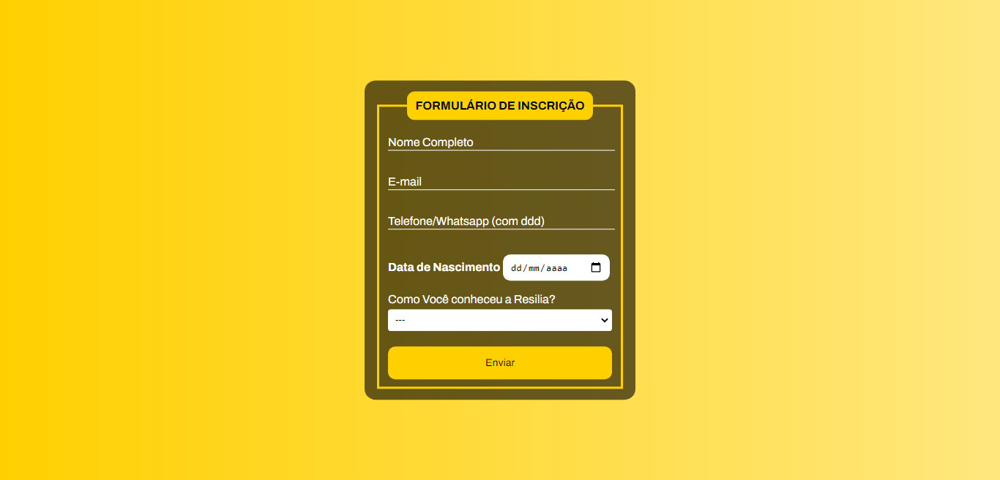

  # Projeto: Formulário de inscrição Resilia 📋

  <a href="#sobre">Sobre</a>&nbsp;&nbsp;
  <a href="#andamento">Andamento</a>&nbsp;&nbsp;
  <a href="#linguagens">Softwares & Ferramentas</a>&nbsp;&nbsp;
  <a href="#habilidades">Habilidades adquiridas</a>&nbsp;&nbsp;
  <a href="#contribuir">Como contribuir</a>&nbsp;&nbsp;
  <a href="#autor">Autor</a> 

<h2 id="sobre">Sobre 🔎</h2>

Formulário criado durante um homework passado pelo facilitador tech Artur Moreira, do curso webdev Full Stack da Resilia onde precisávamos criar um formulário utilizando HTML e CSS com os seguintes campos: 

* Nome
* Email
* Telefone
* Data de nascimento
* Botão de envio

<h2 id="andamento">Andamento do projeto 📈</h2>

<h2 id="linguagens">Softwares & Ferramentas utilizadas nesse projeto 📚</h2>

- [x] HTML5
- [x] CSS3

<h2 id="habilidades">Habilidades Adquiridas 📝</h2>

- Indentação do código
- Link entre html x css externo
- Utilização de fontes de texto externas
- Label, Input (HTML)
- Option, Select (HTML)
- Uso do atributo For (HTML)
- Classes e Id's (HTML)
- Seletores (CSS)
- Gradientes de cores (CSS)
- Pseudo-classes (CSS)

<h2 id="contribuir">Como contribuir 📫</h2>

Para contribuir com meu projeto, siga estas etapas:
  >- Bifurque este repositório.
  >- Crie um branch: `git checkout -b <nome_branch>`.
  >- Faça suas alterações e confirme-as: `git commit -m '<mensagem_commit>'`
  >- Envie para o branch original: `git push origin <nome_do_projeto> / <local>`
  >- Crie a solicitação de pull.
*Consulte a documentação do GitHub em* [como criar uma solicitação pull](https://help.github.com/en/github/collaborating-with-issues-and-pull-requests/creating-a-pull-request).

  
  **Criado e desenvolvido por [Ytallo Bruno](https://www.linkedin.com/in/ytallobruno/).**
  
 
 
  
   &nbsp;&nbsp;&nbsp;&nbsp;&nbsp;
  
   &nbsp;&nbsp;&nbsp;&nbsp;&nbsp;
  
  

 

  &#129145;&nbsp;<a href="#inicio"><strong>Voltar ao topo</strong></a>&nbsp;&#129145;

